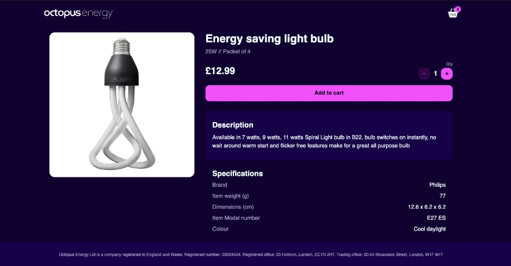
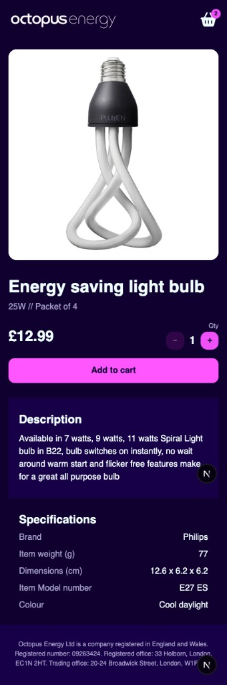

<div align="center">
  
  <h1>Octopus Energy Frontend code test</h1>
</div>

> By Harry Ashton - [GitHub](https://github.com/thehashton)

In this code test, you'll be asked to:

- Make a React application that follows the design in `design.jpg` and consumes the API. Even though the app is quite simple, it should be designed in a scalable and maintainable way. Ideally the app should be responsive.

We've included:

- A sample [Next.js](https://nextjs.org/) project with a Typescript setup for your convenience.
- Some CSS colour variables that match the colours in the design as guidance.
- The assets that you will need to complete the design.

## Preview

<div align="center">
  <p><strong>Desktop.</strong> The product page on a wide screen, with the image beside the details.</p>
  <p></p>
</div>

<div align="center">
  <p><strong>Mobile.</strong> The same page once the layout wraps into a single column.</p>
  <p></p>
</div>

## Getting started

First you'll need to install your dependencies

```sh
cd client && pnpm install
```

## Start the app

```sh
cd client && pnpm dev
```

This will do two things:

- Start a Next.js app running in development on <http://localhost:3000>
- Start a graphQL stub server running on <http://localhost:3001/graphql>

## Running tests

Tests live in `client/test` and run with Vitest. The `test` script is on the client package, and the repo root forwards to it, so this works from the project root:

```sh
pnpm test
```

That starts watch mode, so the suite reruns when a test or the code it covers is saved. Press `q` to stop it.

Run the suite once, the same way CI would:

```sh
pnpm test -- --run
```

Run a single file:

```sh
pnpm test -- test/cart.test.tsx
```

The suite covers price formatting, the quantity stepper, adding a selected quantity to the cart, the product page and catalogue card, and the hard-coded catalogue used when `DEMO_MODE=true`.

## What we're looking for

We want to see how you approach this problem in a real-world scenario. Consider how your solution scales, handles edge cases, and anticipates future requirements in a production environment.

We would like you to demonstrate your ability to:

- Reason through a programming problem
- Proficiently use Nextjs and Typescript
- Implement a visual design accurately
- Implement some user interactions
- Write production-ready code for a high traffic app
- Write tests that document and safeguard the program's behaviour
- Use a version control system (e.g. git) to effectively convey intent

Best of luck!
